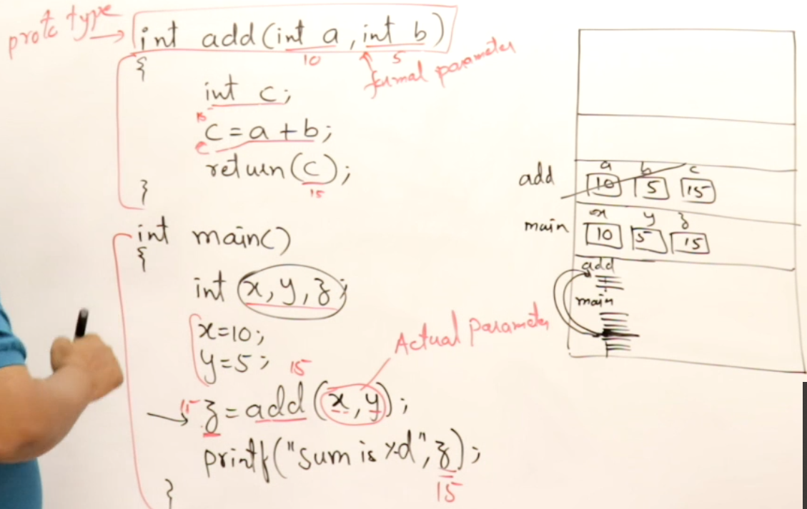
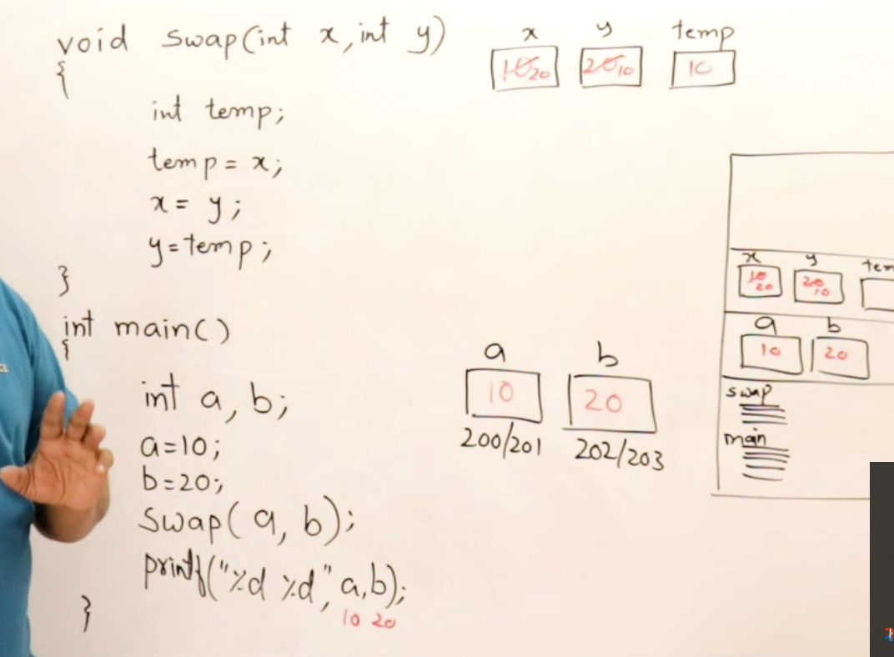
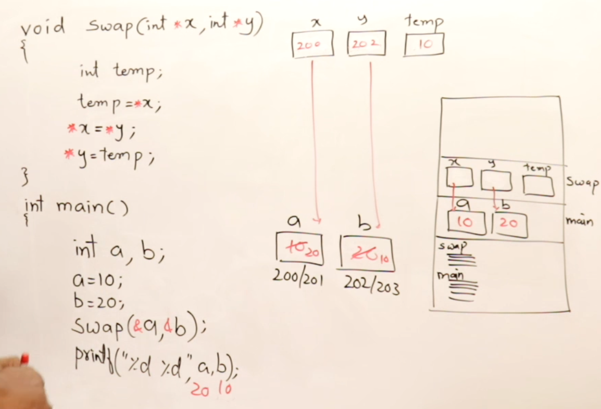
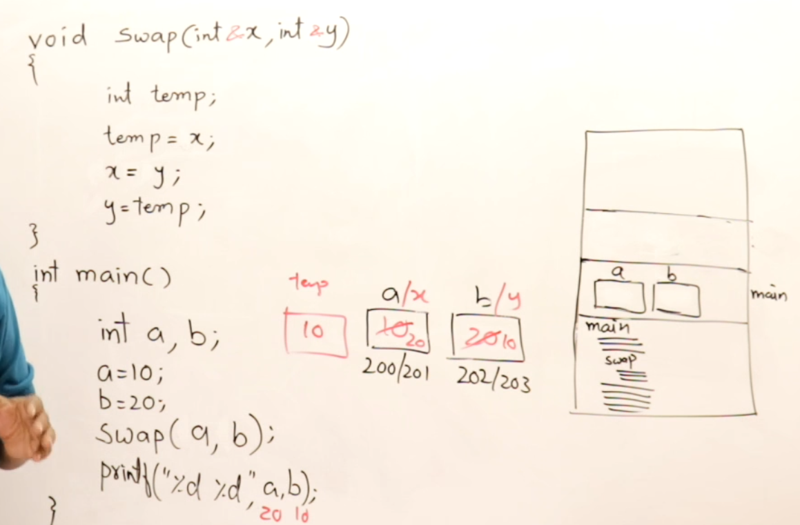

# Time and sapce complextity
# Time complexity: depeand on only 
# ___________________________
# here is all array concept
# int [A] this is called initilaztion of array
# # int [A]={1,2,3,4,5,6} this is called initialization of array with values as you can sath ini... with deaclaratin
# Refrence mean ike ek bar humne 1 define kiya thik hi ab ko humne dusra valu se define kr diya like int &r=a ye ho gya refrence agr tumen kl ko r++ kr diya a=bhi 1+1 -2 ho jayega aur r =2 ho jayga smjhi yarr
# pass by value pass by refrence pass by adress
# let's see hum tumhe sb smjhate h dekho ek bat phle function se shure krte hi function k hum isilye use krte hi isse se bhut faiyda hi smjhi kaise dekho function ko hum  ek barr likh do bar use kr skte hi aur waise agr hum int main ke ander sari chije likhe to bhut hi jayda code ho jayege aur thik nhi rhega to dusra faida ye bhi hi 
# hume function ko ek barr likhne ke bad hum use kai bar use kr skte hi thik hi 
 # dekho hum code likhte hi pta hi tumhe actual paramete  formal pramete aur prototype
# MAIN PROTOTYPE DECLERATION OF A FUNCTION DEFINATION OF A FUNCTION ko hi ELABORATION KO KHTE HI 
#  as you see all of thease in this sreen shot  
# now turn to explain by value by refrence by adress 
# pass by value ka mtlb hi ki tum fommal pramete me chnage hoga sirf actual prameter me chnage nhi hoga
# dekho screenshot me  
# now  by adress smjhte hi bilkul same concept like by value isme actual pramete change ho jate hii
# ye le screnn shot  
# now turn to explain pass by refrence dekh isem same like actual paramete change ho jati hi like pass by address ok
# ye dekh skte ho 